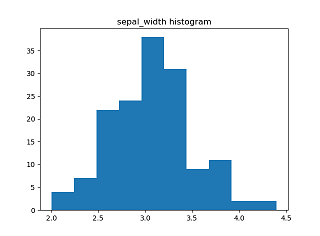
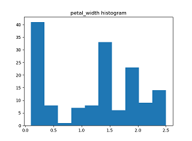
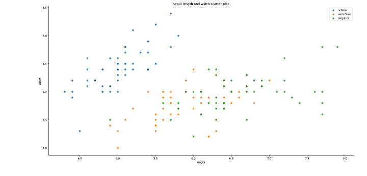
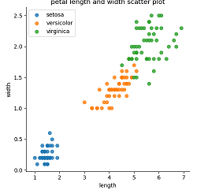
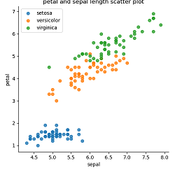
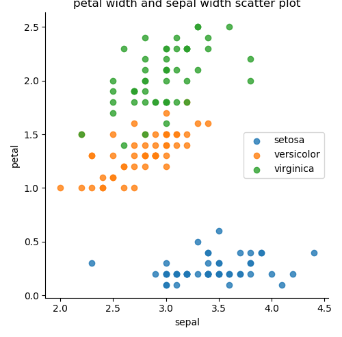

# Project 2018

## Problem statement

The following project concerns the well-known Fischer's Iris data set. The project entails you reseacrhing the data set, and then writing documentation and code in the Python programming language based on that research.

An online search for information on the data set will convince you that many people have investigated and written about it previously, and may of those are not experienced programmers, You are expected to be able to break this project into several smaller tasks that are easier to solve, and to plug these together after they have been completed. You might do that for this project as follows:

**1. Research back ground information about the data set and write a summary about it.**


One of the first multivariate data sets was introduced by British statiscian and biologist Ronald Fischer in 1936. This was named the Iris flower data set or Fisher's Iris data set. It is sometimes referred to as Anderson's Iris data set as it was Edgar Anderson who collected the data to quantify the morphologic variation of Iris flowers of three related species. There are 150 rows of data in the dataet and each row of the dataset represents an iris flower, including its species and dimensions of its botanical parts, sepal and petal, in centimeters. [Ref: Iris flower data set](https://en.wikipedia.org/wiki/Iris_flower_data_set)


The above picture shows the three species contained in each class of the dataset - Iris setosa, Iris virginica and Iris versicolor. The dataset contains 50 samples each of these species with their botanical dimensions, sepal and petal, included in each row of the dataset.


Four features were measured from each sample: the length and the width of the sepals and petals, in centimetres. The sepal is described as a part of the flower of angiosperms (flowering plants). Sepals typically function as protection for the flower in bud, and often as support for the petals when in bloom. [Ref: Sepal](https://en.wikipedia.org/wiki/Sepal) Petals are described as modified leaves that surround the reproductive parts of flowers. [Ref: Petal](https://en.wikipedia.org/wiki/Petal) 


Although Fischer's Iris flower data set was initially compiled to identify the botanical variations of Iris flowers, it has since become a famous data set for testing purposes in the computer science world. [Ref: alternative uses](https://www.techopedia.com/definition/32880/iris-flower-data-set) It is a well known, standard data set which programmers repeatedly use as an input to examine how various technologies sort and handle data sets. It is also used for testing out machine learning algorithms and visualizations (for example, Scatter Plot, Histogram). The above picture shows an epample of how the Iris flower data set is used in machine learning algorithms. [Ref: Machine learning algorithms](https://stats.stackexchange.com/questions/268561/example-of-backpropagation-for-neural-network-with-softmax-and-sigmoid-activatio)

**See below table of the 150 samples of the Iris flower data set containing sepal length, sepal width, petal length, petal width and species columns of data.**

|sepal_length | sepal_width | petal_length | petal_width | species |
| --- | --- | --- | --- | --- |
5.1 | 3.5 | 1.4 | 0.2 | Iris-setosa
4.9 | 3.0 | 1.4 | 0.2 | Iris-setosa
4.7 | 3.2 | 1.3 | 0.2 | Iris-setosa
4.6 | 3.1 | 1.5 | 0.2 | Iris-setosa
5.0 | 3.6 | 1.4 | 0.2 | Iris-setosa
5.4 | 3.9 | 1.7 | 0.4 | Iris-setosa
4.6 | 3.4 | 1.4 | 0.3 | Iris-setosa
5.0 | 3.4 | 1.5 | 0.2 | Iris-setosa
4.4 | 2.9 | 1.4 | 0.2 | Iris-setosa
4.9 | 3.1 | 1.5 | 0.1 | Iris-setosa
5.4 | 3.7 | 1.5 | 0.2 | Iris-setosa
4.8 | 3.4 | 1.6 | 0.2 | Iris-setosa
4.8 | 3.0 | 1.4 | 0.1 | Iris-setosa
4.3 | 3.0 | 1.1 | 0.1 | Iris-setosa
5.8 | 4.0 | 1.2 | 0.2 | Iris-setosa
5.7 | 4.4 | 1.5 | 0.4 | Iris-setosa
5.4 | 3.9 | 1.3 | 0.4 | Iris-setosa
5.1 | 3.5 | 1.4 | 0.3 | Iris-setosa
5.7 | 3.8 | 1.7 | 0.3 | Iris-setosa
5.1 | 3.8 | 1.5 | 0.3 | Iris-setosa
5.4 | 3.4 | 1.7 | 0.2 | Iris-setosa
5.1 | 3.7 | 1.5 | 0.4 | Iris-setosa
4.6 | 3.6 | 1.0 | 0.2 | Iris-setosa
5.1 | 3.3 | 1.7 | 0.5 | Iris-setosa
4.8 | 3.4 | 1.9 | 0.2 | Iris-setosa
5.0 | 3.0 | 1.6 | 0.2 | Iris-setosa
5.0 | 3.4 | 1.6 | 0.4 | Iris-setosa
5.2 | 3.5 | 1.5 | 0.2 | Iris-setosa
5.2 | 3.4 | 1.4 | 0.2 | Iris-setosa
4.7 | 3.2 | 1.6 | 0.2 | Iris-setosa
4.8 | 3.1 | 1.6 | 0.2 | Iris-setosa
5.4 | 3.4 | 1.5 | 0.4 | Iris-setosa
5.2 | 4.1 | 1.5 | 0.1 | Iris-setosa
5.5 | 4.2 | 1.4 | 0.2 | Iris-setosa
4.9 | 3.1 | 1.5 | 0.1 | Iris-setosa
5.0 | 3.2 | 1.2 | 0.2 | Iris-setosa
5.5 | 3.5 | 1.3 | 0.2 | Iris-setosa
4.9 | 3.1 | 1.5 | 0.1 | Iris-setosa
4.4 | 3.0 | 1.3 | 0.2 | Iris-setosa
5.1 | 3.4 | 1.5 | 0.2 | Iris-setosa
5.0 | 3.5 | 1.3 | 0.3 | Iris-setosa
4.5 | 2.3 | 1.3 | 0.3 | Iris-setosa
4.4 | 3.2 | 1.3 | 0.2 | Iris-setosa
5.0 | 3.5 | 1.6 | 0.6 | Iris-setosa
5.1 | 3.8 | 1.9 | 0.4 | Iris-setosa
4.8 | 3.0 | 1.4 | 0.3 | Iris-setosa
5.1 | 3.8 | 1.6 | 0.2 | Iris-setosa
4.6 | 3.2 | 1.4 | 0.2 | Iris-setosa
5.3 | 3.7 | 1.5 | 0.2 | Iris-setosa
5.0 | 3.3 | 1.4 | 0.2 | Iris-setosa
7.0 | 3.2 | 4.7 | 1.4 | Iris-versicolor
6.4 | 3.2 | 4.5 | 1.5 | Iris-versicolor
6.9 | 3.1 | 4.9 | 1.5 | Iris-versicolor
5.5 | 2.3 | 4.0 | 1.3 | Iris-versicolor
6.5 | 2.8 | 4.6 | 1.5 | Iris-versicolor
5.7 | 2.8 | 4.5 | 1.3 | Iris-versicolor
6.3 | 3.3 | 4.7 | 1.6 | Iris-versicolor
4.9 | 2.4 | 3.3 | 1.0 | Iris-versicolor
6.6 | 2.9 | 4.6 | 1.3 | Iris-versicolor
5.2 | 2.7 | 3.9 | 1.4 | Iris-versicolor
5.0 | 2.0 | 3.5 | 1.0 | Iris-versicolor
5.9 | 3.0 | 4.2 | 1.5 | Iris-versicolor
6.0 | 2.2 | 4.0 | 1.0 | Iris-versicolor
6.1 | 2.9 | 4.7 | 1.4 | Iris-versicolor
5.6 | 2.9 | 3.6 | 1.3 | Iris-versicolor
6.7 | 3.1 | 4.4 | 1.4 | Iris-versicolor
5.6 | 3.0 | 4.5 | 1.5 | Iris-versicolor
5.8 | 2.7 | 4.1 | 1.0 | Iris-versicolor
6.2 | 2.2 | 4.5 | 1.5 | Iris-versicolor
5.6 | 2.5 | 3.9 | 1.1 | Iris-versicolor
5.9 | 3.2 | 4.8 | 1.8 | Iris-versicolor
6.1 | 2.8 | 4.0 | 1.3 | Iris-versicolor
6.3 | 2.5 | 4.9 | 1.5 | Iris-versicolor
6.1 | 2.8 | 4.7 | 1.2 | Iris-versicolor
6.4 | 2.9 | 4.3 | 1.3 | Iris-versicolor
6.6 | 3.0 | 4.4 | 1.4 | Iris-versicolor
6.8 | 2.8 | 4.8 | 1.4 | Iris-versicolor
6.7 | 3.0 | 5.0 | 1.7 | Iris-versicolor
6.0 | 2.9 | 4.5 | 1.5 | Iris-versicolor
5.7 | 2.6 | 3.5 | 1.0 | Iris-versicolor
5.5 | 2.4 | 3.8 | 1.1 | Iris-versicolor
5.5 | 2.4 | 3.7 | 1.0 | Iris-versicolor
5.8 | 2.7 | 3.9 | 1.2 | Iris-versicolor
6.0 | 2.7 | 5.1 | 1.6 | Iris-versicolor
5.4 | 3.0 | 4.5 | 1.5 | Iris-versicolor
6.0 | 3.4 | 4.5 | 1.6 | Iris-versicolor
6.7 | 3.1 | 4.7 | 1.5 | Iris-versicolor
6.3 | 2.3 | 4.4 | 1.3 | Iris-versicolor
5.6 | 3.0 | 4.1 | 1.3 | Iris-versicolor
5.5 | 2.5 | 4.0 | 1.3 | Iris-versicolor
5.5 | 2.6 | 4.4 | 1.2 | Iris-versicolor
6.1 | 3.0 | 4.6 | 1.4 | Iris-versicolor
5.8 | 2.6 | 4.0 | 1.2 | Iris-versicolor
5.0 | 2.3 | 3.3 | 1.0 | Iris-versicolor
5.6 | 2.7 | 4.2 | 1.3 | Iris-versicolor
5.7 | 3.0 | 4.2 | 1.2 | Iris-versicolor
5.7 | 2.9 | 4.2 | 1.3 | Iris-versicolor
6.2 | 2.9 | 4.3 | 1.3 | Iris-versicolor
5.1 | 2.5 | 3.0 | 1.1 | Iris-versicolor
5.7 | 2.8 | 4.1 | 1.3 | Iris-versicolor
6.3 | 3.3 | 6.0 | 2.5 | Iris-virginica
5.8 | 2.7 | 5.1 | 1.9 | Iris-virginica
7.1 | 3.0 | 5.9 | 2.1 | Iris-virginica
6.3 | 2.9 | 5.6 | 1.8 | Iris-virginica
6.5 | 3.0 | 5.8 | 2.2 | Iris-virginica
7.6 | 3.0 | 6.6 | 2.1 | Iris-virginica
4.9 | 2.5 | 4.5 | 1.7 | Iris-virginica
7.3 | 2.9 | 6.3 | 1.8 | Iris-virginica
6.7 | 2.5 | 5.8 | 1.8 | Iris-virginica
7.2 | 3.6 | 6.1 | 2.5 | Iris-virginica
6.5 | 3.2 | 5.1 | 2.0 | Iris-virginica
6.4 | 2.7 | 5.3 | 1.9 | Iris-virginica
6.8 | 3.0 | 5.5 | 2.1 | Iris-virginica
5.7 | 2.5 | 5.0 | 2.0 | Iris-virginica
5.8 | 2.8 | 5.1 | 2.4 | Iris-virginica
6.4 | 3.2 | 5.3 | 2.3 | Iris-virginica
6.5 | 3.0 | 5.5 | 1.8 | Iris-virginica
7.7 | 3.8 | 6.7 | 2.2 | Iris-virginica
7.7 | 2.6 | 6.9 | 2.3 | Iris-virginica
6.0 | 2.2 | 5.0 | 1.5 | Iris-virginica
6.9 | 3.2 | 5.7 | 2.3 | Iris-virginica
5.6 | 2.8 | 4.9 | 2.0 | Iris-virginica
7.7 | 2.8 | 6.7 | 2.0 | Iris-virginica
6.3 | 2.7 | 4.9 | 1.8 | Iris-virginica
6.7 | 3.3 | 5.7 | 2.1 | Iris-virginica
7.2 | 3.2 | 6.0 | 1.8 | Iris-virginica
6.2 | 2.8 | 4.8 | 1.8 | Iris-virginica
6.1 | 3.0 | 4.9 | 1.8 | Iris-virginica
6.4 | 2.8 | 5.6 | 2.1 | Iris-virginica
7.2 | 3.0 | 5.8 | 1.6 | Iris-virginica
7.4 | 2.8 | 6.1 | 1.9 | Iris-virginica
3.7.9 | 3.8 | 6.4 | 2.0 | Iris-virginica
6.4 | 2.8 | 5.6 | 2.2 | Iris-virginica
6.3 | 2.8 | 5.1 | 1.5 | Iris-virginica
6.1 | 2.6 | 5.6 | 1.4 | Iris-virginica
7.7 | 3.0 | 6.1 | 2.3 | Iris-virginica
6.3 | 3.4 | 5.6 | 2.4 | Iris-virginica
6.4 | 3.1 | 5.5 | 1.8 | Iris-virginica
6.0 | 3.0 | 4.8 | 1.8 | Iris-virginica
6.9 | 3.1 | 5.4 | 2.1 | Iris-virginica
6.7 | 3.1 | 5.6 | 2.4 | Iris-virginica
6.9 | 3.1 | 5.1 | 2.3 | Iris-virginica
5.8 | 2.7 | 5.1 | 1.9 | Iris-virginica
6.8 | 3.2 | 5.9 | 2.3 | Iris-virginica
6.7 | 3.3 | 5.7 | 2.5 | Iris-virginica
6.7 | 3.0 | 5.2 | 2.3 | Iris-virginica
6.3 | 2.5 | 5.0 | 1.9 | Iris-virginica
6.5 | 3.0 | 5.2 | 2.0 | Iris-virginica
6.2 | 3.4 | 5.4 | 2.3 | Iris-virginica
5.9 | 3.0 | 5.1 | 1.8 | Iris-virginica


**2. Keep a list of references you used in completing the project.**

https://en.wikipedia.org/wiki/Iris_flower_data_set
https://en.wikipedia.org/wiki/Petal
https://en.wikipedia.org/wiki/Sepal)
http://archive.ics.uci.edu/ml/machine-learning-databases/iris/iris.data
https://www.techopedia.com/definition/32880/iris-flower-data-set
https://en.wikipedia.org/wiki/NumPy
https://en.wikipedia.org/wiki/Pandas_%28software%29
https://en.wikipedia.org/wiki/Median
https://docs.scipy.org/doc/numpy/user/basics.io.genfromtxt.html?highlight=array
https://www.w3resource.com/python-exercises/re/python-re-exercise-47.php
https://stats.stackexchange.com/questions/268561/example-of-backpropagation-for-neural-network-with-softmax-and-sigmoid-activatio
https://www.thoughtco.com/what-is-a-histogram-3126359
https://en.wikipedia.org/wiki/Matplotlib
https://seaborn.pydata.org/


**3. Download the data set and write some Python code to investigate it**

   Summary of python files uploaded to project repository to investigate the Iris flower data set  
1. openfile1.py - A program that opens a .csv file, reads it, prints it and closes it again
2. openfile2.py - An alernative program opens a .csv file, reads it, prints it and closes it again
3. Split.py - A program that reads and formats the Iris Data set
4. Investigate.py - A program that reads a .csv file, manipulates the data to provide analysis on it and prints max, min, sum, count & average of each column

#### openfile1.py - A program that opens a .csv file, reads it, prints it and closes it again
 
```Python
# Fiona Nealon, 2018-04-27
# Iris data set analysis
# A program to open a .csv file, read it, print it and close again

# Open iris.csv file in subfolder
f = open("data/iris.csv")

# Output information about file
print(f)

# Print contents of file
print(f.read())

# Close iris.csv file
f.close()
```
#### Discussion and analysis of openfile1.py
 
The above piece of code opens a file object using open(). The file being opened in this case is the iris.csv in th data subfolder. The program prints some information about the file using ```print(f)```. The program then reads the file and prints it using ```print(f.read())```. It is good practise to close the file before the program exits. Otherwise, the program is in an indeterminate state. The programs then closes the file using ```f.close()```
 
#### How to run this code:

1. Download [Anaconda](https://anaconda.org/).
2. Install Anaconda
3. Download [Visual Studio Code](https://code.visualstudio.com/download).
4. Install Visual Studio Code
5. Save a new folder on desktop e.g. project iris
6. Copy Iris Flower data set from [Iris Flower Data Set](http://archive.ics.uci.edu/ml/machine-learning-databases/iris/iris.data)
7. Save as .csv file in subfolder called data in project iris folder
8. Save openfile1.py file into project iris folder
7. Open Visual Studio Code
8. Open project iris folder from desktop
9. Open openfile1.py file
10. Open integrated terminal in Visual Studio code (Crtl + ')
11. Type ‘python openfile1.py’ in the command prompt in the terminal
12. Press enter

#### openfile2.py - An alernative program that opens a .csv file, reads it, prints it and closes it again

```Python
# Fiona Nealon, 2018-04-27
# Iris data set analysis
# An alernative program to open a .csv file, read it, print it and close again

# Open .csv file with f as a variable
with open("data/iris.csv") as f:

# Read contents of file
  contents = f.read()

# Print contents of file
  print(contents)
```
#### Discussion and analysis of openfile2.py

The above piece of code is an alternative program for opening a file, reading a file, printing a file and and close the file once complete using a 'with' statement. The code states that with the data/iris.csv file as f, create a block of python code where f is a variable and each line of code indented after this with statement can access f (data/iris.csv) file. The program reads the contents of the file and assigns it to 'contents' and prints them using the print function. The 'with statement' will close f (data/iris.csv) file once it reaches an unindented line of code.

#### How to run this code:

1. Download [Anaconda](https://anaconda.org/).
2. Install Anaconda
3. Download [Visual Studio Code](https://code.visualstudio.com/download).
4. Install Visual Studio Code
5. Save a new folder on desktop e.g. project iris
6. Copy Iris Flower data set from [Iris Flower Data Set](http://archive.ics.uci.edu/ml/machine-learning-databases/iris/iris.data)
7. Save as .csv file in subfolder called data in project iris folder
8. Save openfile1.py file into project iris folder
7. Open Visual Studio Code
8. Open project iris folder from desktop
9. Open openfile2.py file
10. Open integrated terminal in Visual Studio code (Crtl + ')
11. Type ‘python openfile2.py’ in the command prompt in the terminal
12. Press enter

#### split.py - A program that reads and formats the Iris Data set

```Python
# Fiona Nealon, 2018-04-05
# A program that reads and formats the Iris Data set

# Open the data csv file in data sub folder. Also close the data csv file once complete. 
with open("data/iris.csv")as f:

# Loop through lines of data csv file 
  for line in f:

# Prints the first four columns of data
    print(line.split(',')[0], line.split(',')[1], line.split(',')[2], line.split(',')[3])
```
#### Discussion and analysis of split.py

The above block of code opens the iris.csv file in the sub folder, loops through this file, formats this file, prints the formatted file and closes the file once complete. It is good practise to close a file once complete. This code states that with the data/iris.csv file as f, create a block of python code where f is a variable and each line of code indented after this with statement can access f (data/iris.csv) file. The 'with statement' will close f (data/iris.csv) file once it reaches an unindented line of code.The 'for loop' loops through each of the lines on  f (data/iris.csv) file.

```python
print(line.split(',')[0], line.split(',')[1], line.split(',')[2], line.split(',')[3])
```
The above 'split' command splits each line into a python list. The 'index' method finds the given element in a list and returns its position so [0] prints the first column in the list, [1] prints the second column in the list, [2] prints the third column on the list and [3] prints the fourth column on the list.

#### How to run this code:

1. Download [Anaconda](https://anaconda.org/).
2. Install Anaconda
3. Download [Visual Studio Code](https://code.visualstudio.com/download).
4. Install Visual Studio Code
5. Save a new folder on desktop e.g. project iris
6. Copy Iris Flower data set from [Iris Flower Data Set](http://archive.ics.uci.edu/ml/machine-learning-databases/iris/iris.data)
7. Save as .csv file in subfolder called data in project iris folder
8. Save split.py file into project iris folder
7. Open Visual Studio Code
8. Open project iris folder from desktop
9. Open split.py file
10. Open integrated terminal in Visual Studio code (Crtl + ')
11. Type ‘python split.py’ in the command prompt in the terminal
12. Press enter

#### investigate.py - A program that reads a .csv file, manipulates the data to provide analysis on it and prints max, min, sum, count & average of each column

```Python
# Print contents of file
print(f.read())
# Fiona Nealon, 2018-04-27
# Iris data set analysis
# A program to read in a .csv file and print max, min, sum, count & average of each column

# import pandas library
import pandas as pd

# Import numpy library
import numpy as np 

# Adapted from https://www.youtube.com/watch?v=hllTTzHazDY
# Read iris.csv file and assign to dataset
dataset = pd.read_csv('data/iris.csv')

# Get the maximum value of each column 
print('Maximum value of column sepal_length:', dataset['sepal_length'].max())
print('Maximum value of column sepal_length:', dataset['sepal_width'].max())
print('Maximum value of column sepal_length:', dataset['petal_length'].max())
print('Maximum value of column sepal_length:', dataset['petal_width'].max())

# Get the minimum value of each column
print('Minimum value of column sepal_length:', dataset['sepal_length'].min())
print('Minimum value of column sepal_length:', dataset['sepal_width'].min())
print('Minimum value of column sepal_length:', dataset['petal_length'].min())
print('Minimum value of column sepal_length:', dataset['petal_width'].min())

# Get the sum value of each column
print('Sum value of column sepal_length:', dataset['sepal_length'].sum())
print('Sum value of column sepal_length:', dataset['sepal_width'].sum())
print('Sum value of column sepal_length:', dataset['petal_length'].sum())
print('Sum value of column sepal_length:', dataset['petal_width'].sum())

# Get the count of the number of values of each column
print('Count of the number of values in column sepal_length:', dataset['sepal_length'].count())
print('Count of the number of values in column sepal_length:', dataset['sepal_width'].count())
print('Count of the number of values in sepal_length:', dataset['petal_length'].count())
print('Count of the number of values in sepal_length:', dataset['petal_width'].count())

# Get the average/mean of each column
print('The average of values in column sepal_length:', dataset['sepal_length'].mean())
print('The average of values in column sepal_length:', dataset['sepal_width'].mean())
print('The average of values in sepal_length:', dataset['petal_length'].mean())
print('The average of values in sepal_length:', dataset['petal_width'].mean())
```
#### Discussion and analysis of investigate.py
 
The above program finds the maximum, minimum, sum, count and mean of each column in the Iris flower data set. It uses both the numpy and pandas libraries which provide a collection of high level mathemetical functions to operate on arrays to assist with data maipulation and analysis. [Ref: Numpy](https://en.wikipedia.org/wiki/NumPy) [Ref: Pandas](https://en.wikipedia.org/wiki/Pandas_%28software%29)

The program reads the iris.csv file from the subfolder and assigns the name dataset to it. ```dataset = pd.read_csv('data/iris.csv')``` ```pd.read_csv``` is an attribute of the pandas library that reads a csv file into python.

The program calls the max(), min(), sum(), count() and mean() functions to manipulate the data set, provide an analysis of each column and print results to the prompt in the terminal.

In the print functions, the 'index' method finds the given element in an array and returns its position so ['sepal_length'] prints the sepal length column in the array, ['sepal_width'] prints the sepal width column in the array, ['petal_length'] prints the petal length column in the array and ['sepal_length'] prints the sepal length column in the array.

#### How to run this code:

1. Download [Anaconda](https://anaconda.org/).
2. Install Anaconda
3. Download [Visual Studio Code](https://code.visualstudio.com/download).
4. Install Visual Studio Code
5. Save a new folder on desktop e.g. project iris
6. Copy Iris Flower data set from [Iris Flower Data Set](http://archive.ics.uci.edu/ml/machine-learning-databases/iris/iris.data)
7. Save as .csv file in subfolder called data in project iris folder
9. Add column headers to each column on iris.csv file and save
8. Save investigate.py file into project iris folder
7. Open Visual Studio Code
8. Open project iris folder from desktop
9. Open investiagte.py file
10. Open integrated terminal in Visual Studio code (Crtl + ')
11. Type ‘python investigate.py’ in the command prompt in the terminal
12. Press enter

**4. Summarise the data set by, for example calculating the maximun, minimum and mean of each column. A Python script will quickly do this for you**

 Summary of python files uploaded to project repository to investigate the Iris flower data set  
1. mean.py - A python script to calculate the mean of each column
2. max.py - A python script to calculate the maximum of each column
3. min.py - A python script to calculate the minimum of each column
4. median.py - A python script to calculate the median of each column
5. sum.py - A python script to calculate the sum of each column

#### Mean of each column in the Iris flower data set - mean.py

The mean is the average of an array of numbers. It is calculated by summing all of the numbers in the array and then dividing by the total count of numbers.

```Python
# Fiona Nealon, 2018-04-19
# Iris data set analysis

# Calculate the mean of each column in the numpy array

# Use numpy library to analyse Iris file
import numpy
```

The numpy library provides some advanced math functionalities to python. It adds support for large multi-dimensional arrays and provides a collection of high level mathematical functions to operate on these arrays to assist in manipulating numerical data. I will use the numpy.genfromtxt and the numpy.mean functions to read the csv file into python using numpy and calculate the mean of each column in the Iris flower data set. [Ref: numpy](https://en.wikipedia.org/wiki/NumPy)


```Python
# Read csv file into python using numpy
data = numpy.genfromtxt('data/iris.csv', delimiter=',')
```
Using the numpy.genfromtxt function, I will use numpy to read in the iris csv file into this array and assign this array to data. The numpy.genfromtxt function runs two main loops. The first loop converts each line of the file in a sequence of strings. The second loop converts each string to the appropriate data type. [Ref: numpy.genfromtxt](https://docs.scipy.org/doc/numpy/user/basics.io.genfromtxt.html?highlight=array) A delimiter is a sequence of one or more characters used to specify the boundary between separate, independent regions in plain text or other data streams. [Ref: delimiter](https://www.w3resource.com/python-exercises/re/python-re-exercise-47.php)

```Python
# Select all values in first column of numpy array
firstcol = data[:,0]
# Select all values in second column of numpy array
secondcol = data[:,1]
# Select all values in third column of numpy array
thirdcol = data[:,2]
# Select all values in fourth column of numpy array
fourthcol = data[:,3]
```
In the next block of code, I will assign values to the 1st, 2nd, 3rd and 4th columns in the numpy array. Data is a two dimensional array - an array of arrays. ```python Data[0]``` is the usual way to access first element in a list or array. In this case, this will only return the first row of the data. However, I also require the first column of data. To select all of the values in a column in a numpy array, I need to adding the following code ```python :,``` to my code so that this selects everything in the first dimension of the array (the column). ```python Data[0]``` represents the second dimension of the array. I can adjust the index method in my code and apply the same logic to select the second, third and fourth columns of the numpy array.

```Python
# Find the average of the first column of data
meanfirstcol = numpy.mean(firstcol)
# Find the average of the second column of data
meansecondcol = numpy.mean(secondcol)
# Find the average of the third column of data
meanthirdcol = numpy.mean(thirdcol)
# Find the average of the fourth column of data
meanfourthcol = numpy.mean(fourthcol)
```
Using the above block of code, the numpy.mean function calls the values assigned to firstcol, secondcol, thirdcol & fourthcol and calulates the average of each of the columns. The mean value of each of the columns is then assigned to meanfirstcol, meansecondcol, meanthirdcol & meanfourthcol.

```Python
# Print the average of the first column 
print("Average of first column is:", meanfirstcol)
# Print the average of the second column 
print("Average of second column is:", meansecondcol)
# Print the average of the third column 
print("Average of third column is:", meanthirdcol)
# Print the average of the fourth column 
print("Average of fourth column is:", meanfourthcol)
```
The above lines then call the print function with an argument of meanfirstcol, meansecondcol, meanthirdcol and meanfourthcol and prints the values to the command prompt at the terminal. A string has been added to the funtion to provide an explanations of each of the  meanfirstcol, meansecondcol, meanthirdcol and meanfourthcol values.

#### Maximum of each column in the Iris flower data set - max.py

The maximum number is the largest number in an array of numbers. This python script uses a similar logic to the logic used to calculate the mean of each of the columns in the Iris Flower data set.

```Python
# Fiona Nealon, 2018-04-25
# Iris data set analysis

# Calculate the maximum of each column in the numpy array

# Use numpy library to analyse Iris file
import numpy
```

The numpy library provides some advanced math functionalities to python. It adds support for large multi-dimensional arrays and provides a collection of high level mathematical functions to operate on these arrays to assist in manipulating numerical data. I will use the numpy.genfromtxt and the numpy.max functions to read the csv file into python using numpy and calculate the max of each column in the Iris flower data set. [Ref: numpy](https://en.wikipedia.org/wiki/NumPy)

```Python
# Read csv file into python using numpy
data = numpy.genfromtxt('data/iris.csv', delimiter=',')
```
Using the numpy.genfromtxt function, I will use numpy to read in the iris csv file into this array and assign this array to data. The numpy.genfromtxt function runs two main loops. The first loop converts each line of the file in a sequence of strings. The second loop converts each string to the appropriate data type. [Ref: numpy.genfromtxt](https://docs.scipy.org/doc/numpy/user/basics.io.genfromtxt.html?highlight=array) A delimiter is a sequence of one or more characters used to specify the boundary between separate, independent regions in plain text or other data streams. [Ref: delimiter](https://www.w3resource.com/python-exercises/re/python-re-exercise-47.php)

```Python
# Select all values in first column of numpy array
firstcol = data[:,0]
# Select all values in second column of numpy array
secondcol = data[:,1]
# Select all values in third column of numpy array
thirdcol = data[:,2]
# Select all values in fourth column of numpy array
fourthcol = data[:,3]
```
In the next block of code, I will assign values to the 1st, 2nd, 3rd and 4th columns in the numpy array. Data is a two dimensional array - an array of arrays. ```python Data[0]``` is the usual way to access first element in a list or array. In this case, this will only return the first row of the data. However, I also require the first column of data. To select all of the values in a column in a numpy array, I need to adding the following code ```python :,``` to my code so that this selects everything in the first dimension of the array (the column). ```python Data[0]``` represents the second dimension of the array. I can adjust the index method in my code and apply the same logic to select the second, third and fourth columns of the numpy array.

```Python
maxfirstcol = numpy.max(firstcol)
# Find the maximum of the second column of data
maxsecondcol = numpy.max(secondcol)
# Find the maximum of the third column of data
maxthirdcol = numpy.max(thirdcol)
# Find the maximum of the fourth column of data
maxfourthcol = numpy.max(fourthcol)
```
Using the above block of code, the numpy.max function calls the values assigned to firstcol, secondcol, thirdcol & fourthcol and calulates the maximum of each of the columns. The maximum value of each of the columns is then assigned to maxfirstcol, maxsecondcol, maxthirdcol & maxfourthcol.

```Python
# Print the maximum of the first column 
print("Maximum of first column is:", maxfirstcol)
# Print the maximum of the second column 
print("Maximum of second column is:", maxsecondcol)
# Print the maximum of the third column 
print("Maximum of third column is:", maxthirdcol)
# Print the maximum of the fourth column 
print("Maximum of fourth column is:", maxfourthcol)
```
The above lines then call the print function with an argument of minfirstcol, minsecondcol, minthirdcol and minfourthcol and prints the values to the command prompt at the terminal. A string has been added to the funtion to provide an explanations of each of the  maxfirstcol, maxsecondcol, maxthirdcol and maxfourthcol values.


#### Minimum of each column in the Iris flower data set - min.py

The minimum number is the smallest number in an array of numbers. This python script uses a similar logic to the logic used to calculate the mean of each of the columns in the Iris Flower data set.

```Python
# Fiona Nealon, 2018-04-19
# Iris data set analysis

# Calculate the minimum of each column in the numpy array

# Use numpy library to analyse Iris file
import numpy
```

The numpy library provides some advanced math functionalities to python. It adds support for large multi-dimensional arrays and provides a collection of high level mathematical functions to operate on these arrays to assist in manipulating numerical data. I will use the numpy.genfromtxt and the numpy.min functions to read the csv file into python using numpy and calculate the min of each column in the Iris flower data set. [Ref: numpy](https://en.wikipedia.org/wiki/NumPy)

```Python
# Read csv file into python using numpy
data = numpy.genfromtxt('data/iris.csv', delimiter=',')
```
Using the numpy.genfromtxt function, I will use numpy to read in the iris csv file into this array and assign this array to data. The numpy.genfromtxt function runs two main loops. The first loop converts each line of the file in a sequence of strings. The second loop converts each string to the appropriate data type. [Ref: numpy.genfromtxt](https://docs.scipy.org/doc/numpy/user/basics.io.genfromtxt.html?highlight=array) A delimiter is a sequence of one or more characters used to specify the boundary between separate, independent regions in plain text or other data streams. [Ref: delimiter](https://www.w3resource.com/python-exercises/re/python-re-exercise-47.php)

```python
# Select all values in first column of numpy array
firstcol = data[:,0]
# Select all values in second column of numpy array
secondcol = data[:,1]
# Select all values in third column of numpy array
thirdcol = data[:,2]
# Select all values in fourth column of numpy array
fourthcol = data[:,3]
```
In the next block of code, I will assign values to the 1st, 2nd, 3rd and 4th columns in the numpy array. Data is a two dimensional array - an array of arrays. ```python Data[0]``` is the usual way to access first element in a list or array. In this case, this will only return the first row of the data. However, I also require the first column of data. To select all of the values in a column in a numpy array, I need to adding the following code ```python :,``` to my code so that this selects everything in the first dimension of the array (the column). ```python Data[0]``` represents the second dimension of the array. I can adjust the index method in my code and apply the same logic to select the second, third and fourth columns of the numpy array.

```Python
# Find the minimum of the first column of data
minfirstcol = numpy.min(firstcol)
# Find the minimum of the second column of data
minsecondcol = numpy.min(secondcol)
# Find the minimum of the third column of data
minthirdcol = numpy.min(thirdcol)
# Find the minimum of the fourth column of data
minfourthcol = numpy.min(fourthcol)
```
In the next block of code, I will assign values to the 1st, 2nd, 3rd and 4th columns in the numpy array. Data is a two dimensional array - an array of arrays. ```python Data[0]``` is the usual way to access first element in a list or array. In this case, this will only return the first row of the data. However, I also require the first column of data. To select all of the values in a column in a numpy array, I need to adding the following code ```python :,``` to my code so that this selects everything in the first dimension of the array (the column). ```python Data[0]``` represents the second dimension of the array. I can adjust the index method in my code and apply the same logic to select the second, third and fourth columns of the numpy array.

```Python
# Print the minimum of the first column
print("Minimum of first column is:", minfirstcol)
# Print the minimum of the second column
print("Minimum of second column is:", minsecondcol)
# Print the minimum of the third column
print("Minimum of third column is:", minthirdcol)
# Print the minimum if the fourth column
print("Minimum of fourth column is:", minfourthcol)
```
The above lines the call the print function with an argument of minfirstcol, minsecondcol, minthirdcol and minfourthcol and prints the values to the command prompt at the terminal. A string has been added to the funtion to provide an explanations of each of the  minfirstcol, minsecondcol, minthirdcol and minfourthcol values.

#### Median of each column in the Iris flower data set - median.py

The median is the value separating the higher half of a data sample, a population, or a probability distribution, from the lower half. For a data set, it may be thought of as the "middle" value. [Ref: Median](https://en.wikipedia.org/wiki/Median) This python script uses a similar logic to the logic used to calculate the mean of each of the columns in the Iris Flower data set.

```Python

# Fiona Nealon, 2018-04-19
# Iris data set analysis

# Calculate the median of each column in the numpy array

# Use numpy library to analyse Iris file
import numpy
```
The numpy library provides some advanced math functionalities to python. It adds support for large multi-dimensional arrays and provides a collection of high level mathematical functions to operate on these arrays to assist in manipulating numerical data. I will use the numpy.genfromtxt and the numpy.median functions to read the csv file into python using numpy and calculate the min of each column in the Iris flower data set. [Ref: numpy](https://en.wikipedia.org/wiki/NumPy)

```Python
# Read csv file into python using numpy
data = numpy.genfromtxt('data/iris.csv', delimiter=',')
```
Using the numpy.genfromtxt function, I will use numpy to read in the iris csv file into this array and assign this array to data. The numpy.genfromtxt function runs two main loops. The first loop converts each line of the file in a sequence of strings. The second loop converts each string to the appropriate data type. [Ref: numpy.genfromtxt](https://docs.scipy.org/doc/numpy/user/basics.io.genfromtxt.html?highlight=array) A delimiter is a sequence of one or more characters used to specify the boundary between separate, independent regions in plain text or other data streams. [Ref: delimiter](https://www.w3resource.com/python-exercises/re/python-re-exercise-47.php)

```python
# Select all values in first column of numpy array
firstcol = data[:,0]
# Select all values in second column of numpy array
secondcol = data[:,1]
# Select all values in third column of numpy array
thirdcol = data[:,2]
# Select all values in fourth column of numpy array
fourthcol = data[:,3]
```
In the next block of code, I will assign values to the 1st, 2nd, 3rd and 4th columns in the numpy array. Data is a two dimensional array - an array of arrays. ```python Data[0]``` is the usual way to access first element in a list or array. In this case, this will only return the first row of the data. However, I also require the first column of data. To select all of the values in a column in a numpy array, I need to adding the following code ```python :,``` to my code so that this selects everything in the first dimension of the array (the column). ```python Data[0]``` represents the second dimension of the array. I can adjust the index method in my code and apply the same logic to select the second, third and fourth columns of the numpy array.

```Python
# Find the median of the first column of data
medianfirstcol = numpy.median(firstcol)
# Find the median of the second column of data
mediansecondcol = numpy.median(secondcol)
# Find the median of the third column of data
medianthirdcol = numpy.median(thirdcol)
# Find the median of the fourth column of data
medianfourthcol = numpy.median(fourthcol)
```
In the next block of code, I will assign values to the 1st, 2nd, 3rd and 4th columns in the numpy array. Data is a two dimensional array - an array of arrays. ```python Data[0]``` is the usual way to access first element in a list or array. In this case, this will only return the first row of the data. However, I also require the first column of data. To select all of the values in a column in a numpy array, I need to adding the following code ```python :,``` to my code so that this selects everything in the first dimension of the array (the column). ```python Data[0]``` represents the second dimension of the array. I can adjust the index method in my code and apply the same logic to select the second, third and fourth columns of the numpy array.

```Python
# Print the median of the first column
print("Median of first column is:", medianfirstcol)
# Print the median of the second column
print("Median of second column is:", mediansecondcol)
# Print the median of the third column
print("Median of third column is:", medianthirdcol)
# Print the median if the fourth column
print("Median of fourth column is:", medianfourthcol)
```
The above lines the call the print function with an argument of medianfirstcol, mmediansecondcol, medianthirdcol and medianfourthcol and prints the values to the command prompt at the terminal. A string has been added to the funtion to provide an explanations of each of the  medianfirstcol, mediansecondcol, medianthirdcol and medianfourthcol values.

#### Sum of each column in the Iris flower data set - sum.py

The sum number is the total number of all the numbers added together in an array of numbers. This python script uses a similar logic to the logic used to calculate the mean of each of the columns in the Iris Flower data set.

```Python

# Fiona Nealon, 2018-04-26
# Iris data set analysis
# Calculate the sum of each column in the numpy array

# Use numpy library to analyse Iris file
import numpy
```

The numpy library provides some advanced math functionalities to python. It adds support for large multi-dimensional arrays and provides a collection of high level mathematical functions to operate on these arrays to assist in manipulating numerical data. I will use the numpy.genfromtxt and the numpy.sum functions to read the csv file into python using numpy and calculate the min of each column in the Iris flower data set. [Ref: numpy](https://en.wikipedia.org/wiki/NumPy)

```Python
# Read csv file into python using numpy
data = numpy.genfromtxt('data/iris.csv', delimiter=',')
```
Using the numpy.genfromtxt function, I will use numpy to read in the iris csv file into this array and assign this array to data. The numpy.genfromtxt function runs two main loops. The first loop converts each line of the file in a sequence of strings. The second loop converts each string to the appropriate data type. [Ref: numpy.genfromtxt](https://docs.scipy.org/doc/numpy/user/basics.io.genfromtxt.html?highlight=array) A delimiter is a sequence of one or more characters used to specify the boundary between separate, independent regions in plain text or other data streams. [Ref: delimiter](https://www.w3resource.com/python-exercises/re/python-re-exercise-47.php)

```python
# Select all values in first column of numpy array
firstcol = data[:,0]
# Select all values in second column of numpy array
secondcol = data[:,1]
# Select all values in third column of numpy array
thirdcol = data[:,2]
# Select all values in fourth column of numpy array
fourthcol = data[:,3]
```
In the next block of code, I will assign values to the 1st, 2nd, 3rd and 4th columns in the numpy array. Data is a two dimensional array - an array of arrays. ```python Data[0]``` is the usual way to access first element in a list or array. In this case, this will only return the first row of the data. However, I also require the first column of data. To select all of the values in a column in a numpy array, I need to adding the following code ```python :,``` to my code so that this selects everything in the first dimension of the array (the column). ```python Data[0]``` represents the second dimension of the array. I can adjust the index method in my code and apply the same logic to select the second, third and fourth columns of the numpy array.


```Python
# Find the sum of the first column of data
sumfirstcol = numpy.min(firstcol)
# Find the sum of the second column of data
sumsecondcol = numpy.min(secondcol)
# Find the sum of the third column of data
sumthirdcol = numpy.min(thirdcol)
# Find the sum of the fourth column of data
sumfourthcol = numpy.min(fourthcol)
```

In the next block of code, I will assign values to the 1st, 2nd, 3rd and 4th columns in the numpy array. Data is a two dimensional array - an array of arrays. ```python Data[0]``` is the usual way to access first element in a list or array. In this case, this will only return the first row of the data. However, I also require the first column of data. To select all of the values in a column in a numpy array, I need to adding the following code ```python :,``` to my code so that this selects everything in the first dimension of the array (the column). ```python Data[0]``` represents the second dimension of the array. I can adjust the index method in my code and apply the same logic to select the second, third and fourth columns of the numpy array.

```Python
# Print the sum of the first column
print("Sum of first column is:", sumfirstcol)
# Print the sum of the second column
print("Sum of second column is:", sumsecondcol)
# Print the sum of the third column
print("Sum of third column is:", sumthirdcol)
# Print the sum if the fourth column
print("Sum of fourth column is:", sumfourthcol)
```
The above lines the call the print function with an argument of sumfirstcol, sumsecondcol, sumthirdcol and sumfourthcol and prints the values to the command prompt at the terminal. A string has been added to the funtion to provide an explanations of each of the  sumfirstcol, sumsecondcol, sumthirdcol and sumfourthcol values.

**5 & 6. Write a summary of your investigations and include graphics and code as you deem necessary.**

#### Histograms

Histograms provide a visual interpretation of numerical univariate data by indicating the number of data points that lie within a range of values.  These range of of values are called classes or bins. The frequency of the data that falls in each class is depicted by the use of a bar.  The higher that the bar is, the greater the frequency of data values in that bin. Bar chart for continuous data values.

 #### Summary of python files uploaded to project repository to output a histogram
1. sepallengthhist.py  - A python file to output a histogram of sepal length
2. sepalwidthhist.py  - A python file to output a histogram of sepal width
3. petallengthhist.py   - A python file to output a histogram of petal length
4. petalwidthhist.py  - A python file to output a histogram of petal width

**1. sepallengthhist.py  - A python file to output a histogram of sepal length**

```python
# Fiona Nealon, 2018-04-28
# Iris data set analysis
# Create a histogram for sepal length

# Use numpy library to analyse Iris file
import numpy

# Read csv file into python using numpy
data = numpy.genfromtxt('data/iris.csv', delimiter=',')

# Select all values in first column of numpy array
firstcol = data[:,0]

# Use matplotlib & pyplot libraries to plot histogram
import matplotlib.pyplot as pl

# Plot histogram of the first column
pl.hist(firstcol)

# Add title to histogram
pl.title('sepal_length histogram')

# Output the histogram
pl.show()
```
#### Discussion and analysis of sepallengthhist.py

To create a histogram for sepal length, I have used the numpy library to read in the iris.csv file from the data subfolder. I have selected all the sepal length values in the array by indexing the first column in the array. ```firstcol = data[:,0]```Matplotlib and pyplot are graphics and plotting liraries in python and can be used to create a variety of graphs in python e.g. histogram, bar and scatter. in this case, I have used matplotlib and pyplot to create a histogram ```pl.hist```. The ```pl.title('sepal_length histogram')``` piece of code adds a title to the histogram while ```pl.show()``` outputs the below histogram in png format.


In the python code I have ran previously, I have already established that the average of the values of sepal length is 5.84, the minimum of these values is 4.3 and the maximum of these values is 7.9. Now I have created a histogram with matplotlib and pyplot to demonstrate the frequency in which these values occur. From the above histogram, I can see minimum value of sepal length starting on the x axis at 4.3 and the maximum value of sepal length finishing on the x axis at 7.9. The y axis also shows the frequency in which these values occur. The histogram bars appear to peak around the 5.5 to 6.0 region which demonstrates that the highest frequency of sepal length values are in this region. I have also previously ran some python code to calculate the average of the values of sepal length to be 5.84.

#### How to run this code:

1. Download [Anaconda](https://anaconda.org/).
2. Install Anaconda
3. Download [Visual Studio Code](https://code.visualstudio.com/download).
4. Install Visual Studio Code
5. Save a new folder on desktop e.g. project iris
6. Copy Iris Flower data set from [Iris Flower Data Set](http://archive.ics.uci.edu/ml/machine-learning-databases/iris/iris.data)
7. Save as .csv file in subfolder called data in project iris folder
8. Save sepallengthhist.py file into project iris folder
7. Open Visual Studio Code
8. Open project iris folder from desktop
9. Open sepallengthhist.py file
10. Open integrated terminal in Visual Studio code (Crtl + ')
11. Type ‘python sepallengthhist.py’ in the command prompt in the terminal
12. Press enter

**2. sepalwidthhist.py  - A python file to output a histogram of sepal width**

```python
# Fiona Nealon, 2018-04-28
# Iris data set analysis
# Create a histogram for sepal width

# Use numpy library to analyse Iris file
import numpy

# Read csv file into python using numpy
data = numpy.genfromtxt('data/iris.csv', delimiter=',')

# Select all values in second column of numpy array
secondcol = data[:,1]

# Use matplotlib & pyplot libraries to plot histogram
import matplotlib.pyplot as pl

# Plot histogram of the second column
pl.hist(secondcol)

# Add title to histogram
pl.title('sepal_width histogram')

# Output the histogram
pl.show()
```
#### Discussion and analysis of sepalwidthhist.py

To create a histogram for sepal width, I have used the numpy library to read in the iris.csv file from the data subfolder. I have selected all the sepal width values in the array by indexing the second column in the array. ```secondcol = data[:,1]```Matplotlib and pyplot are graphics and plotting liraries in python and can be used to create a variety of graphs in python e.g. histogram, bar and scatter. in this case, I have used matplotlib and pyplot to create a histogram ```pl.hist```. The ```pl.title('sepal_width histogram')``` piece of code adds a title to the histogram while ```pl.show()``` outputs the below histogram in png format.



In the python code I have ran previously, I have already established that the average of the values of sepal width is 3.05, the minimum of these values is 2.0 and the maximum of these values is 4.4. Now I have created a histogram with matplotlib and pyplot to demonstrate the frequency in which these values occur. From the above histogram, I can see minimum value of sepal width starting on the x axis at 2.0 and the maximum value of sepal width finishing on the x axis at 4.4. The y axis also shows the frequency in which these values occur. The histogram bars appear to peak around the 3.0 to 3.2 region which demonstrates that the highest frequency of sepal width values are in this region. I have also previously ran some python code to calculate the average of the values of sepal width to be 3.05.

#### How to run this code:

1. Download [Anaconda](https://anaconda.org/).
2. Install Anaconda
3. Download [Visual Studio Code](https://code.visualstudio.com/download).
4. Install Visual Studio Code
5. Save a new folder on desktop e.g. project iris
6. Copy Iris Flower data set from [Iris Flower Data Set](http://archive.ics.uci.edu/ml/machine-learning-databases/iris/iris.data)
7. Save as .csv file in subfolder called data in project iris folder
8. Save sepalwidthhist.py file into project iris folder
7. Open Visual Studio Code
8. Open project iris folder from desktop
9. Open sepalwidthhist.py file
10. Open integrated terminal in Visual Studio code (Crtl + ')
11. Type ‘python sepalwidthhist..py’ in the command prompt in the terminal
12. Press enter

**3. petallengthhist.py  - A python file to output a histogram of petal length**

```python
# Fiona Nealon, 2018-04-28
# Iris data set analysis
# Create a histogram for petal length

# Use numpy library to analyse Iris file
import numpy

# Read csv file into python using numpy
data = numpy.genfromtxt('data/iris.csv', delimiter=',')

# Select all values in third column of numpy array
thirdcol = data[:,2]

# Use numatplotlib & pyplot libraries to plot histogram
import matplotlib.pyplot as pl

# Plot histogram of the third column
pl.hist(thirdcol)

# Add title to histogram
pl.title('petal_length histogram')

# Output the histogram
pl.show()
```
#### Discussion and analysis of petallengthhist.py

To create a histogram for petal length, I have used the numpy library to read in the iris.csv file from the data subfolder. I have selected all the petal length values in the array by indexing the third column in the array. ```thirdcol = data[:,]```Matplotlib and pyplot are graphics and plotting liraries in python and can be used to create a variety of graphs in python e.g. histogram, bar and scatter. in this case, I have used matplotlib and pyplot to create a histogram ```pl.hist```. The ```pl.title('petal_length histogram')``` piece of code adds a title to the histogram while ```pl.show()``` outputs the below histogram in png format.


In the python code I have ran previously, I have already established that the average of the values of petal length is 3.75, the minimum of these values is 1.0 and the maximum of these values is 6.9. Now I have created a histogram with matplotlib and pyplot to demonstrate the frequency in which these values occur. From the above histogram, I can see minimum value of petal length starting on the x axis at 1.0 and the maximum value of petal length finishing on the x axis at 6.9. The y axis also shows the frequency in which these values occur. This histogram shows that although the average of petal length values is 3.05, the highest frequency of petal length values is not in this region. The frequency of this value is actually only around 3 to 4. There are two peaks in the histogram around the 1.0 to 2.0 values and the 3.0 to 4.0 to values. The average of value of petal length is actually an average of these two peaks.

#### How to run this code:

1. Download [Anaconda](https://anaconda.org/).
2. Install Anaconda
3. Download [Visual Studio Code](https://code.visualstudio.com/download).
4. Install Visual Studio Code
5. Save a new folder on desktop e.g. project iris
6. Copy Iris Flower data set from [Iris Flower Data Set](http://archive.ics.uci.edu/ml/machine-learning-databases/iris/iris.data)
7. Save as .csv file in subfolder called data in project iris folder
8. Save petallengthhist.py file into project iris folder
7. Open Visual Studio Code
8. Open project iris folder from desktop
9. Open petallengthhist.py file
10. Open integrated terminal in Visual Studio code (Crtl + ')
11. Type ‘python petallengthhist.py’ in the command prompt in the terminal
12. Press enter

**4. petalwidthhist.py  - A python file to output a histogram of petal width**

```python
# Iris data set analysis
# Create a histogram for petal width

# Use numpy library to analyse Iris file
import numpy

# Read csv file into python using numpy
data = numpy.genfromtxt('data/iris.csv', delimiter=',')

# Select all values in fourth column of numpy array
fourthcol = data[:,3]

# Use matplotlib & pyplot libraries to plot histogram
import matplotlib.pyplot as pl

# Plot histogram of the fourth column
pl.hist(fourthcol)

# Add title to histogram
pl.title('petal_width histogram')

# Output the histogram
pl.show()
```
#### Discussion and analysis of petalwidthhist.py

To create a histogram for petal width, I have used the numpy library to read in the iris.csv file from the data subfolder. I have selected all the petal width values in the array by indexing the fourth column in the array. ```fourthcol = data[:,3]```Matplotlib and pyplot are graphics and plotting liraries in python and can be used to create a variety of graphs in python e.g. histogram, bar and scatter. in this case, I have used matplotlib and pyplot to create a histogram ```pl.hist```. The ```pl.title('petal_length histogram')``` piece of code adds a title to the histogram while ```pl.show()``` outputs the below histogram in png format.



In the python code I have ran previously, I have already established that the average of the values of petal width is 1.19, the minimum of these values is 0.1 and the maximum of these values is 2.5. Now I have created a histogram with matplotlib and pyplot to demonstrate the frequency in which these values occur. From the above histogram, I can see minimum value of petal width starting on the x axis at 0.1 and the maximum value of petal length finishing on the x axis at 2.5. The y axis also shows the frequency in which these values occur. This histogram shows that although the average of petal length values is 1.19, there aappears to be 3 peaks in the frequency of the values of petal width - at .01, 1.5 and 2.0. The average of value of petal length is actually an average of these three peaks.

#### How to run this code:

1. Download [Anaconda](https://anaconda.org/).
2. Install Anaconda
3. Download [Visual Studio Code](https://code.visualstudio.com/download).
4. Install Visual Studio Code
5. Save a new folder on desktop e.g. project iris
6. Copy Iris Flower data set from [Iris Flower Data Set](http://archive.ics.uci.edu/ml/machine-learning-databases/iris/iris.data)
7. Save as .csv file in subfolder called data in project iris folder
8. Save petallengthhist.py file into project iris folder
7. Open Visual Studio Code
8. Open project iris folder from desktop
9. Open petallengthhist.py file
10. Open integrated terminal in Visual Studio code (Crtl + ')
11. Type ‘python petallengthhist.py’ in the command prompt in the terminal
12. Press enter

#### Scatter plots

A scatter plot is a type of plot or mathematical diagram using Cartesian coordinates to display values for typically two variables for a set of data. If the points are color-coded, one additional variable can be displayed. The data are displayed as a collection of points, each having the value of one variable determining the position on the horizontal axis and the value of the other variable determining the position on the vertical axis.


#### Summary of python files uploaded to project repository to output a scatter plot

1. sepal.py - A python file to output a scatter plot of sepal length and width
2. petal.py - A python file to output a histogram of petal length and width
3. length.py - A python file to output a histogram of sepal and petal length
4. width.py - A python file to output a histogram of sepal and petal width

**1. sepal.py - A python file to output a scatter plot of sepal length and width**

```python
# Fiona Nealon, 2018-04-28
# Iris data set analysis
# Create a scatter plot for sepal width and length

# Use matplotlib & pyplot libraries to plot scatter plot
import matplotlib.pyplot as pl

# Use seaborn library to analyse data
import seaborn as sns

# Read csv file into python using seaborn
iris = sns.load_dataset("iris")

# Select all values in sepal length array
iris["length"] = iris["sepal_length"]

# Select all values in sepal width array
iris["width"] = iris["sepal_width"]

# Adapted from: https://stackoverflow.com/questions/45862223/use-different-colors-in-scatterplot-for-iris-dataset 
# Use seaborn to compare variables
sns.lmplot(x="length", y="width", data=iris, hue="species", fit_reg=False, legend=False)

# Add legend to scatter plot
pl.legend()

# Add title to scatter plot
pl.title('sepal length and width scatter plot')

# Output scatter plot
pl.show()
```
#### Discussion and analysis of sepal.py

To create a scatter plot for the sepal length and width variables, I have used the seaborn library to read in the iris.csv file from the data subfolder. Seaborn is a graphics library based on matplotlib and it provides a high-level interface for drawing attractive statistical graphics. I have then selected the sepal length and sepal width columns form the seaborn iris file for my scatter plot. I have used the implot attribute from the seaborn library to plot the scatter plot and to add a legend for the column 'species' to it. I have used matplotlib and pyplot to create a histogram ```pl.hist```. The ```pl.title('sepal length and width scatter plot')``` piece of code adds a title to the histogram while ```pl.show()``` outputs the below scatter plot in png format.



In tha above scatter plot, I have added sepal length to the x axis and sepal width to the y axis. A dot is added to the scatter plot for each sepal width and sepal length from each row on the iris data file. The legend provides an explanation for each of the three colours displayed on the scatter graph. The setosa species are denoted by blue dots, the versicolour species are denoted by orange dots and the virginica species are denoted by green dots. A scatter plot shows the relationship between two variables - the sepal length and width. For the setosa species, the above scatter plot shows that the sepals of this species tend to be wider but not longer than the sepals of the other two species. The sepals of the versicolour species tend to be longer than the setosa species but tend not to be as wide. The sepals of the virginica species tend to be the longest of all the three species but these sepals don't tend to be as a wide as the setosa species. 

#### How to run this code:

1. Download [Anaconda](https://anaconda.org/).
2. Install Anaconda
3. Download [Visual Studio Code](https://code.visualstudio.com/download).
4. Install Visual Studio Code
5. Save a new folder on desktop e.g. project iris
6. Copy Iris Flower data set from [Iris Flower Data Set](http://archive.ics.uci.edu/ml/machine-learning-databases/iris/iris.data)
7. Save as .csv file in subfolder called data in project iris folder
8. Save petallengthhist.py file into project iris folder
7. Open Visual Studio Code
8. Open project iris folder from desktop
9. Open petallengthhist.py file
10. Open integrated terminal in Visual Studio code (Crtl + ')
11. Type ‘python petallengthhist.py’ in the command prompt in the terminal
12. Press enter


**2. petal.py - A python file to output a scatter plot of petal length and width**

```python
# Fiona Nealon, 2018-04-28
# Iris data set analysis
# Create a scatter plot for petal width and length

# Use matplotlib & pyplot libraries to plot scatter plot
import matplotlib.pyplot as pl

# Use seaborn library to analyse data
import seaborn as sns

# Read csv file into python using seaborn
iris = sns.load_dataset("iris")

# Select all values in petal length array
iris["length"] = iris["petal_length"]

# Select all values in petal width array
iris["width"] = iris["petal_width"]

# Adapted from: https://stackoverflow.com/questions/45862223/use-different-colors-in-scatterplot-for-iris-dataset 
# Use seaborn to compare variables
sns.lmplot(x="length", y="width", data=iris, hue="species", fit_reg=False, legend=False)

# Add legend to scatter plot
pl.legend()

# Add title to scatter plot
pl.title('petal length and width scatter plot')

# Output scatter plot
pl.show()
```
#### Discussion and analysis of petal.py

To create a scatter plot for the petal length and width variables, I have used the seaborn library to read in the iris.csv file from the data subfolder. Seaborn is a graphics library based on matplotlib and it provides a high-level interface for drawing attractive statistical graphics. I have then selected the petal length and sepal width columns form the seaborn iris file for my scatter plot. I have used the implot attribute from the seaborn library to plot the scatter plot and to add a legend for the column 'species' to it. I have used matplotlib and pyplot to create a histogram ```pl.hist```. The ```pl.title('sepal length and width scatter plot')``` piece of code adds a title to the histogram while ```pl.show()``` outputs the below scatter plot in png format.



In tha above scatter plot, I have added petal length to the x axis and sepal width to the y axis. A dot is added to the scatter plot for each petal width and sepal length from each row on the iris data file. The legend provides an explanation for each of the three colours displayed on the scatter graph. The setosa species are denoted by blue dots, the versicolour species are denoted by orange dots and the virginica species are denoted by green dots. A scatter plot shows the relationship between two variables - the petal length and width. For the setosa species, the above scatter plot shows that the petals of this species tend to be the smallest of all three species. The sepals of the versicolour species tend to be longer and wider than the setosa species but not log and wide as the virginica species. The petals of the virginica species are the largest of all three species. 

#### How to run this code:

1. Download [Anaconda](https://anaconda.org/).
2. Install Anaconda
3. Download [Visual Studio Code](https://code.visualstudio.com/download).
4. Install Visual Studio Code
5. Save a new folder on desktop e.g. project iris
6. Copy Iris Flower data set from [Iris Flower Data Set](http://archive.ics.uci.edu/ml/machine-learning-databases/iris/iris.data)
7. Save as .csv file in subfolder called data in project iris folder
8. Save petal.py file into project iris folder
7. Open Visual Studio Code
8. Open project iris folder from desktop
9. Open petal.py file
10. Open integrated terminal in Visual Studio code (Crtl + ')
11. Type ‘python petal.py’ in the command prompt in the terminal
12. Press enter


**3. length.py - A python file to output a scatter plot of petal and sepal length**

```python
# Fiona Nealon, 2018-04-28
# Iris data set analysis

# Create a scatter plot for petal and sepal length

# Use matplotlib & pyplot libraries to plot scatter plot
import matplotlib.pyplot as pl

# Use seaborn library to analyse data
import seaborn as sns

# Read csv file into python using seaborn
iris = sns.load_dataset("iris")

# Select all values in petal length array
iris["petal"] = iris["petal_length"]

# Select all values in sepal length array
iris["sepal"] = iris["sepal_length"]

# Adapted from: https://stackoverflow.com/questions/45862223/use-different-colors-in-scatterplot-for-iris-dataset 
# Use seaborn to compare variables
sns.lmplot(x="sepal", y="petal", data=iris, hue="species", fit_reg=False, legend=False)

# Add legend to scatter plot
pl.legend()

# Add title to scatter plot
pl.title('petal and sepal length scatter plot')

# Output scatter plot
pl.show()
```
#### Discussion and analysis of length.py

To create a scatter plot for the petal and sepal length variables, I have used the seaborn library to read in the iris.csv file from the data subfolder. Seaborn is a graphics library based on matplotlib and it provides a high-level interface for drawing attractive statistical graphics. I have then selected the petal and sepal length columns form the seaborn iris file for my scatter plot. I have used the implot attribute from the seaborn library to plot the scatter plot and to add a legend for the column 'species' to it. I have used matplotlib and pyplot to create a histogram ```pl.hist```. The ```pl.title('petal and sepal length scatter plot')``` piece of code adds a title to the histogram while ```pl.show()``` outputs the below scatter plot in png format.



In tha above scatter plot, I have added sepal length to the x axis and petal length to the y axis. A dot is added to the scatter plot for each sepal and petal length from each row on the iris data file. The legend provides an explanation for each of the three colours displayed on the scatter graph. The setosa species are denoted by blue dots, the versicolour species are denoted by orange dots and the virginica species are denoted by green dots. A scatter plot shows the relationship between two variables - the sepal length and petal length. For the setosa species, the above scatter plot shows that the sepals and petals of this species tend to be the shortest of all three species. The sepals and petals of the versicolour species tend to be longer than the setosa species but as not long as the virginica species. The sepals and petals of the virginica species are the largest of all three species. 

#### How to run this code:

1. Download [Anaconda](https://anaconda.org/).
2. Install Anaconda
3. Download [Visual Studio Code](https://code.visualstudio.com/download).
4. Install Visual Studio Code
5. Save a new folder on desktop e.g. project iris
6. Copy Iris Flower data set from [Iris Flower Data Set](http://archive.ics.uci.edu/ml/machine-learning-databases/iris/iris.data)
7. Save as .csv file in subfolder called data in project iris folder
8. Save length.py file into project iris folder
7. Open Visual Studio Code
8. Open project iris folder from desktop
9. Open length.py file
10. Open integrated terminal in Visual Studio code (Crtl + ')
11. Type ‘python length.py’ in the command prompt in the terminal
12. Press enter


**4 width.py - A python file to output a scatter plot of petal and sepal width**

```python
# Fiona Nealon, 2018-04-28
# Iris data set analysis
# Create a scatter plot for petal and sepal width

# Use matplotlib & pyplot libraries to plot scatter plot
import matplotlib.pyplot as pl

# Use seaborn library to analyse data
import seaborn as sns

# Read csv file into python using seaborn
iris = sns.load_dataset("iris")

# Select all values in petal width array
iris["petal"] = iris["petal_width"]

# Select all values in sepal width array
iris["sepal"] = iris["sepal_width"]

# Adapted from: https://stackoverflow.com/questions/45862223/use-different-colors-in-scatterplot-for-iris-dataset 
# Use seaborn to compare variables
sns.lmplot(x="sepal", y="petal", data=iris, hue="species", fit_reg=False, legend=False)

# Add legend to scatter plot
pl.legend()

# Add title to scatter plot
pl.title('petal width and sepal width scatter plot')

# Output scatter plot
pl.show()
```
#### Discussion and analysis of width.py

To create a scatter plot for the petal and sepal width variables, I have used the seaborn library to read in the iris.csv file from the data subfolder. Seaborn is a graphics library based on matplotlib and it provides a high-level interface for drawing attractive statistical graphics. I have then selected the petal and sepal width columns form the seaborn iris file for my scatter plot. I have used the implot attribute from the seaborn library to plot the scatter plot and to add a legend for the column 'species' to it. I have used matplotlib and pyplot to create a histogram ```pl.hist```. The ```pl.title('petal and sepal width scatter plot')``` piece of code adds a title to the histogram while ```pl.show()``` outputs the below scatter plot in png format.



In tha above scatter plot, I have added sepal width to the x axis and petal width to the y axis. A dot is added to the scatter plot for each sepal and petal width from each row on the iris data file. The legend provides an explanation for each of the three colours displayed on the scatter graph. The setosa species are denoted by blue dots, the versicolour species are denoted by orange dots and the virginica species are denoted by green dots. A scatter plot shows the relationship between two variables - the sepal width and petal width. For the setosa species, the above scatter plot shows that the sepals and petals of this species tend to be the least wide of all three species. The sepals and petals of the versicolour species tend to be wider than the setosa species but as not wide as the virginica species. The sepals and petals of the virginica species are the widest of all three species. 

#### How to run this code:

1. Download [Anaconda](https://anaconda.org/).
2. Install Anaconda
3. Download [Visual Studio Code](https://code.visualstudio.com/download).
4. Install Visual Studio Code
5. Save a new folder on desktop e.g. project iris
6. Copy Iris Flower data set from [Iris Flower Data Set](http://archive.ics.uci.edu/ml/machine-learning-databases/iris/iris.data)
7. Save as .csv file in subfolder called data in project iris folder
8. Save width.py file into project iris folder
7. Open Visual Studio Code
8. Open project iris folder from desktop
9. Open width.py file
10. Open integrated terminal in Visual Studio code (Crtl + ')
11. Type ‘python width.py’ in the command prompt in the terminal
12. Press enter
# Plan for project

## Iris data set
- Research of Iris data set
- What it contains, what is it about?
- Background
- Why people talk about it so much in data analytics? Famous, standard data set
- How has it benefitted data analysis previously?

## Writing documentation in code in pythin programming language based on research. 
Code that does some preliminary investigation on the data
Summary statistics
- Columns
 - Max value in each column
 - Min value in each column
 - Mean/Average value in each column
 - Median value in each column
 - Spread in data/standard deviation
 - Plot a histogram
 - For loop (sum, average, max, min)
 
## References
Keep track of references. 20+ references


## Supporting Tables and graphs
- Tables in Markdown
- Histogram
- Matplotlib
- Graphics
- Scatterplots (what's a scatterplot, what do scatterplots do?)

## How to run python code

## Readme
- Summary of dataset & investigations
- Images, linnks, references


